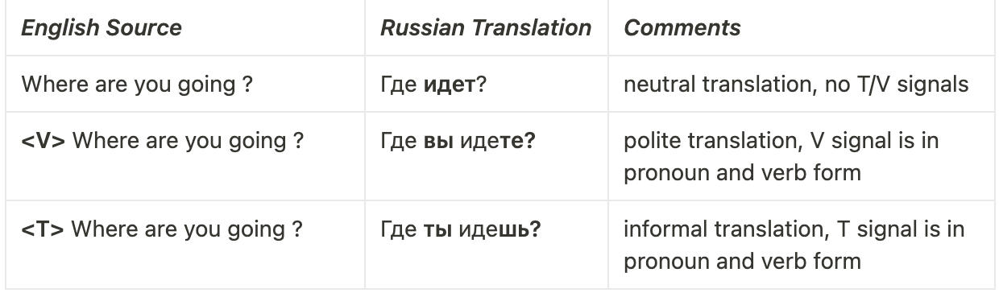
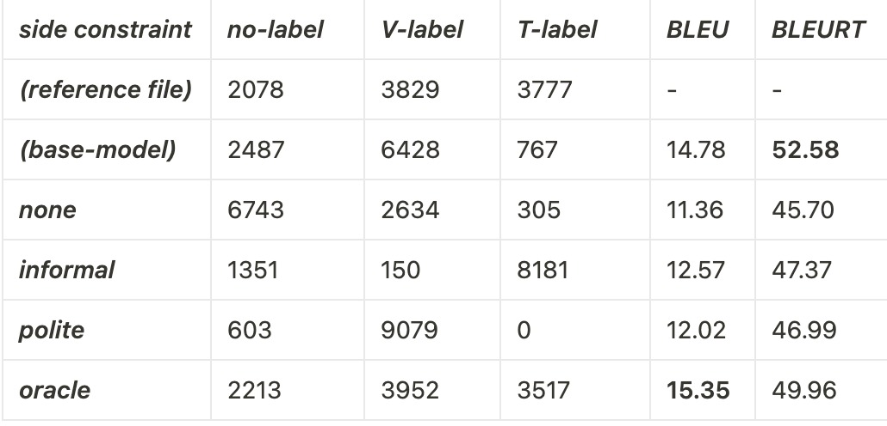

# TV-distinction
This project is aiming to implement honorifics (T/V) distinction for translating English to Russian.

It is inspired by an article ['Controlling Politeness in Neural Machine Translation via Side Constraints'](https://aclanthology.org/N16-1005).

This README provides a short overview of the project, for a lengthy one, please, read this [report](meta/report.pdf).

## Repository
The repo consists of
 - token-based (`code/tv_detector/`) and grammar-based (`code/conll_tv_detector/`) T/V detectors

 - neural-based translation, evaluation ([BLEURT](https://github.com/google-research/bleurt)) and morphosyntactic parsing ([DeepPavlov](http://docs.deeppavlov.ai/en/master/features/models/syntaxparser.html)) models in Jupiter Notebook format (under `code/notebooks/`). 
Those models are intended to use via 'Google Collaboratory'.

 - data processing utilities (`code/helper.py`) and some examples (`code/main.py`)

 - train and test corpora (under `data/`)

 - predicted translations (under `translations/`)

## Data Sources
 Data for training a neural model is taken from the [Yandex 1m EN-RU corpus](https://yandex.ru/legal/corpus/?lang=en). 
 Dataset was sampled to select 22k V-sentences, 8k T-sentences and 100k neutral sentences.

 Test dataset was crafted from [manually annotated sources for solving the deixis problem](https://github.com/lena-voita/good-translation-wrong-in-context/tree/master/consistency_testsets/scoring_data) (Voita et. al, 2019).

## Model
 The model was developed with the [JoeyNMT](https://github.com/joeynmt/joeynmt) as a base translation framework.
 Main notebooks for model training and demonstration are 
 [`code/notebooks/train_TV_model.ipynb`](https://colab.research.google.com/github/tsimafeip/TV-distinction/blob/main/code/notebooks/train_TV_model.ipynb)
 and [`code/notebooks/demo_TV_model.ipynb`](https://colab.research.google.com/github/tsimafeip/TV-distinction/blob/main/code/notebooks/demo_TV_model.ipynb)
 Trained checkpoints and some data files for demo are available on Google Drive ([TV_model](https://drive.google.com/drive/u/1/folders/1xTJCgIXykYt-UfuygOWy9Mxoj_uKQvuX), [base_model](https://drive.google.com/drive/u/1/folders/15we9dFRKmiWw2NPzb-84Ls5T4fWXW9eU)).

## Results

T/V control examples:

Evaluation results:

To sum up, you can see that a simple technique such as prepending T/V tokens to source sentences can add controllability to NMT.

-----
Author: _Tsimafei Prakapenka_
